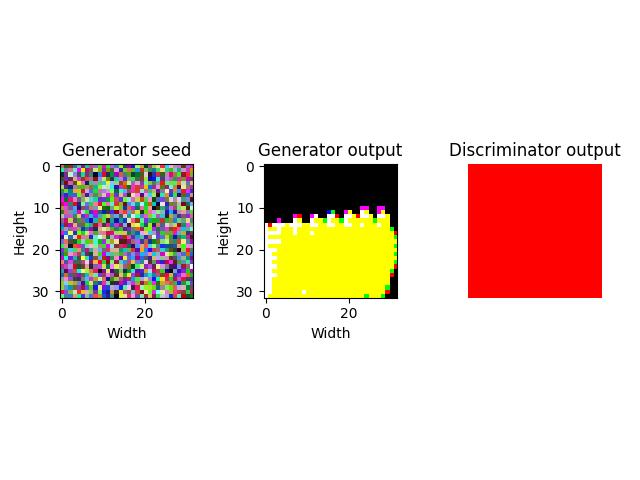
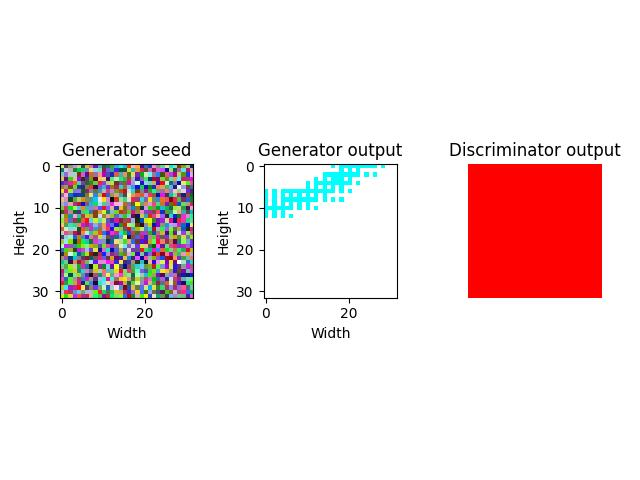

# I'm Something of a Painter Myself - Kaggle Competition

## Summary
This project is an entry for the Kaggle competition "I'm Something of a Painter Myself". The goal of the competition is to generate new images of paintings using Generative Adversarial Networks (GANs). Our approach involves the use of a Discriminator and a Generator, trained using Wasserstein loss with gradient penalty.

## Components
- **Discriminator**: A Convolutional Neural Network (CNN) that classifies whether an image is real or generated.
- **Generator**: A CNN that generates new images from random noise.
- **Discriminator Trainer**: Responsible for training the Discriminator.
- **Generator Trainer**: Responsible for training the Generator.
- **GAN Trainer**: Orchestrates the training of both the Discriminator and the Generator.

## Model Architecture

Our models for this competition are based on the U-Net architecture, which is widely used in image-to-image translation tasks.

### Discriminator
The Discriminator is a Convolutional Neural Network (CNN) that classifies whether an image is real or generated. It consists of several convolutional layers, each followed by a batch normalization layer. The activation function used is LeakyReLU, and the output activation function is a Sigmoid function.

### Generator
The Generator is a U-Net-like CNN with an encoder-decoder structure. The encoder consists of several blocks, each with two convolutional layers followed by a pooling layer. The decoder mirrors the encoder, with several blocks each containing an up-convolutional layer followed by two convolutional layers. The final layer is a convolutional layer. The activation function used in the Generator is also LeakyReLU.

These models work together in the GAN framework, where the Generator tries to fool the Discriminator by generating realistic images, and the Discriminator tries to correctly classify images as real or generated. The models are trained alternately in this adversarial setup.

## Competition Scores and Notebook Links
https://www.kaggle.com/competitions/gan-getting-started/leaderboard

## Findings
An odd thing we observed is that the Generator's training tends to quickly converge to an average loss close to 0, 10 or 20 per epoch. This usually happens starting epoch 10, to epoch 20.

The Discriminator's loss is far more prone to change throughout the entire training duration. It usually starts with a high loss (50+) and gradually decreases.

The Discriminator tends to perform far better than the Generator early on in the training, perhaps leading to the "stunted development" of the generator. We have attempted to get around this by modifying the generator_trainer_run_frequency value (the value representing how often the Generator trains in relation to the Discriminator), but alas we could not find a configuration that allows the Generator to properly develop. This suggests there might be another, yet unidentified, issue.

## Results
Here you can see a few results. 

The leftmost images are the seed static used to generate the image.
The middle image is the generated image.
The rightmost image represents the discriminator's verdict: green = Monet painting, red = not Monet.






## Usage

The following needed:
- the Monet jpeg dataset from Kaggle
- a `data/datasets/monet_jpg` folder
- a `data/cache` folder
- a `data/exports` folder
- a `data/samples` folder
- a venv setup
- the dependencies from `requirements.txt` installed in the venv
- the venv should be activated

The model can be run using the following command:
```bash
$ python3 ./src/main.py
```

Checkpoints will be exported to `wandb_exports`, while samples will be available in the `data/samples` folder.
